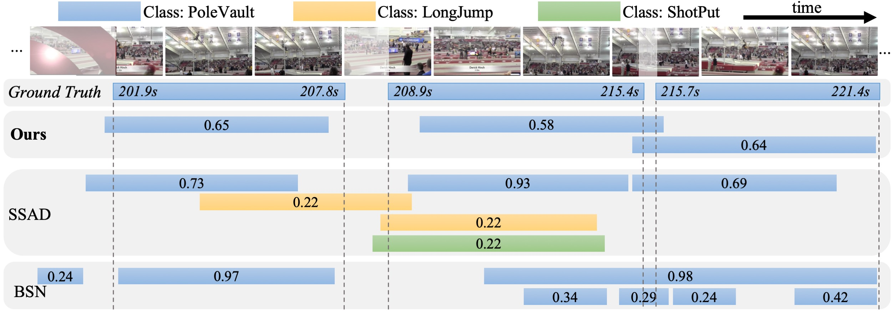
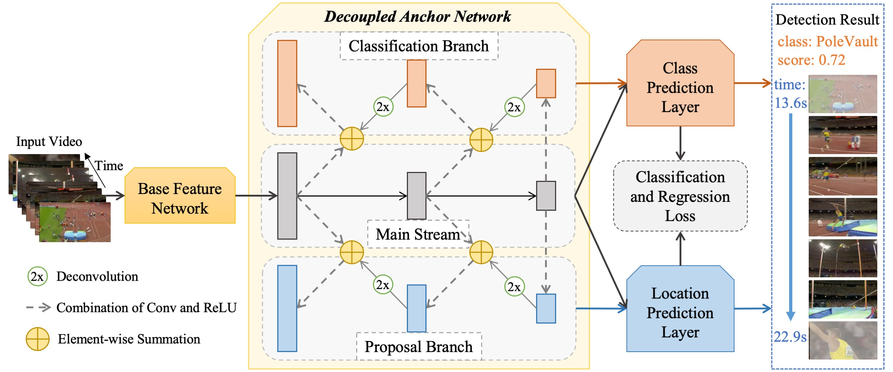
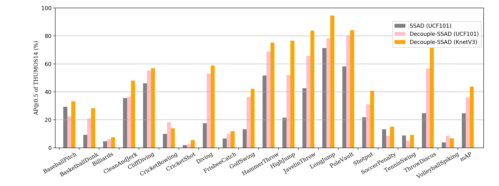

# Decouple-SSAD
Code, models and data for Decouple-SSAD.

[Decoupling Localization and Classification in Single Shot Temporal Action Detection](https://arxiv.org/abs/1904.07442),\
Yupan Huang, Qi Dai, Yutong Lu, in ICME 2019.

Download preprocessed data, final models and the result files for evaluation by visiting 
[Onedrive](https://mail2sysueducn-my.sharepoint.com/:f:/g/personal/huangyp28_mail2_sysu_edu_cn/Eh9uvfgl5CxCmgvaxoWHKfYBuBmd2QVBhDw6SYgzqcA3ZA?e=beDJuO).

An improved version of SSAD ([Single Shot Temporal Action Detection](https://arxiv.org/abs/1710.06236)) 
is also provided in this repository.

## Introduction


Video temporal action detection aims to **temporally localize and recognize the action** in untrimmed videos. 
Existing one-stage approaches mostly focus on unifying two subtasks, i.e., localization of action proposals and 
classification of each proposal through a fully shared backbone. 
However, such design of encapsulating all components of two subtasks in one single network might restrict 
the training by ignoring the specialized characteristic of each subtask.
In this paper, we propose a novel **Decoupled Single Shot temporal Action Detection (Decouple-SSAD)** method to mitigate 
such problem by **decoupling the localization and classification in a *one-stage* scheme**.
Particularly, two separate branches are designed in parallel to enable each component to own representations privately
 for accurate localization or classification.
Each branch produces a set of action anchor layers by applying deconvolution to the feature maps of the main stream.
High-level semantic information from deeper layers is thus incorporated to enhance the feature representations.
We conduct extensive experiments on **THUMOS14** and demonstrate superior performance over state-of-the-art methods.



## Environment
* TensorFlow
* One or more GPU with 12G memory
* Some packages, e.g. pandas, numpy

Have been tested on Ubuntu 16.04
* Python2.7, cuda-8.0, tensorflow v1.4.1
* Python3.5/3.6, cuda-9.0, tensorflow v1.12.0

For example, I use the following commands to set up environment:
``` bash
export PATH=/usr/local/cuda-9.0/bin:$PATH  # select cuda version
export LD_LIBRARY_PATH=/usr/local/cuda-9.0/lib64/

conda create -n Decouple-SSAD pip python=3.6  # select python version
source activate Decouple-SSAD
pip install --upgrade packageURL  # select tensorflow version
# e.g. tensorflow_gpu-1.12.0-cp36-cp36m-linux_x86_64.whl
# download from https://www.tensorflow.org/install/pip#package-location
# or
# pip install tensorflow-gpu --user 
# this command will install the latest version, which may not match with your cuda version

git clone https://github.com/HYPJUDY/Decouple-SSAD.git
cd Decouple-SSAD

# ... follow "Run code" section ...

conda deactivate
```

## Run code

1. [Prepare THUMOS14 data](data/README.md).
2. (Optional) Download final models for direct evaluation.
3. (Optional) Specify your path in [`config.py`](config.py) (e.g. `feature_path`, `get_models_dir()`, `get_predict_result_path()`).
4. (Optional) If you want to experiment with a small dataset to save time, set `small_num_data_for_test = True`
   in [`load_data.py`](load_data.py).
5. Modify `run.sh` to specify gpu(s) device and the other parameters according to your need.
    ``` bash
    bash ./run.sh # for training, evaluation or two-stream results fusion
    ```
    The default `run.sh` do the following things: 
	1. run the two process in parallel:
		* Train and then test Decouple-SSAD pretrained on UCF101 of temporal mode in GPU 0
		* Train and then test Decouple-SSAD pretrained on UCF101 of spatial mode in GPU 1
	2. Then the temporal and spatial streams are fused and results will be saved at `results` folder 
	(e.g., `results/result_fuse_UCF101_decouple_ssad.txt`). 
	Training logs are saved at `logs` folder. Models are save at `models` folder.
6. I evaluate the results by official Matlab code
	```
	cd EvalKit/THUMOS14_evalkit_20150930
	[pr_all,ap_all,map]=TH14evalDet('Decouple-SSAD/results/result_fuse_UCF101_decouple_ssad.txt','annotation','test',0.5);
	```


## Compare with SSAD
Our implementation of Decouple-SSAD is based on SSAD ([Single Shot Temporal Action Detection](https://arxiv.org/abs/1710.06236)). 
We thank Tianwei Lin for his generously sharing code.
We re-train the origin SSAD as our baseline model (i.e., akin to [**the single
main stream of Decouple-SSAD**](main_stream.py)), which follows the overall structure and adopt most of the parameters of SSAD
 but with the following improvements:
  1. We use different video features as model input. SSAD use Snippet-level Action Score (SAS) feature of 303 dimension
   by concatenating the output scores of action classifiers in spatial, temporal and C3D network. 
   While we use the output of feature layer in defined network (e.g. ResNet) as feature. 
   Spatial and temporal features of 1024/2048 dimensions are input to Decouple-SSAD separately and fused lately.
  2. The main hyper-parameters we changed are:
        * the number of convolutional filter in all base layers: 256 -> 512
        * the number of convolutional filter in multi-scale anchor layers: 512 -> 1024
        * scale ratios: `{1,1.5,2}` for fA1 and `{0.5,0.75,1,1.5,2}` for fA2 and fA3
         -> `{0.5,0.75,1,1.5,2}` for fA1, fA2 and fA3
  3. In post-processing, we assign `cliffDiving` class as `diving` class too

Besides to these, some codes of SSAD have been re-structured and modified, 
which may also have influence on the performance.
We conduct ablation study to show that our baseline model ([the main stream](main_stream.py) pretrained on UCF101)
improve mAP@0.5 performance of SSAD **from 24.6% to 31.2% (6.6% relative gains).** 
Moreover, [Decouple-SSAD](decouple_ssad.py) could further enhance the performance significantly, 
providing **4.6%** enhancement against the baseline.


## Performance

Note that the performance may fluctuate 0.5~2% at each training even with the same environment and code.
Occasionally, the mAP of single temporal stream is higher than the fused result (e.g. Decouple-SSAD(KnetV3) in my last training).
Here's the detailed performance report.
Each of the following experiments are run with 2 GeForce RTX 2080 Ti GPUs.

 Method   | pre-train | fuse mAP@0.5| temporal mAP@0.5 | spatial mAP@0.5 | train, test and fuse time | single-stream training time
--------- | :----: | :---: | :----: | :---: | :---: | :---: |
Decouple-SSAD | KnetV3	| **43.7%** | **44.2%**	| **30.7%**	| 86min	| 73min
Decouple-SSAD | UCF101	| 35.8% | 33.1%	| 22.1%	| 77min	| 65min
main-stream-SSAD| UCF101  | 31.2% | 30.0% | 18.3%	| **53min**	| **42min**

For those who are interested in the detection AP over different action categories with overlap threshold 0.5 in THUMOS14,
please refer to `fig/plot_class_ap.py` for precised number and a visualization comparision is as follow:



## Contact
Feel free to open issues or email to me for issues or help using Decouple-SSAD. Any feedback is welcome!
